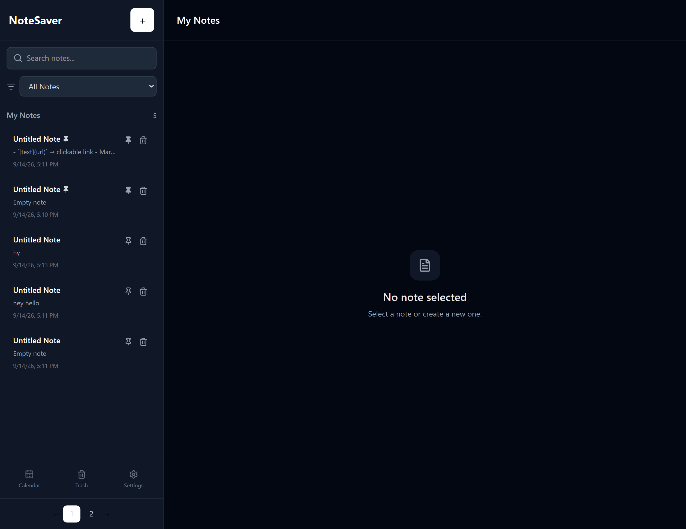

# 📝 NoteSaver

NoteSaver is a simple and user-friendly note-taking application built with React. It allows users to create, edit, search, organize, pin, delete, restore, and manage notes efficiently.



## ✨ Features

* 📝 Create and edit notes
* 🔍 Search notes by title or content
* 📌 Pin and unpin notes
* 🗂️ Filter notes
* 📄 Pagination for notes
* 🗑️ Move notes to Recently Deleted
* ♻️ Restore deleted notes
* 📅 Calendar view
* ⚙️ Settings page
* 🌙 Light, Dark, and System themes
* 💾 Local storage for persistent data
* ⚡ Auto-save option
* ✅ Confirmation before deleting notes
* ♻️ Confirmation before restoring notes
* ✍️ Markdown preview
* 🔢 Word and character count
* 🕒 Display last updated time
* 📱 Responsive user interface

## 🛠️ Technologies Used

- **React 19** — Frontend UI
- **Vite** — Development and build tool
- **Tailwind CSS 4** — Styling and responsive design
- **React Router DOM** — Application routing
- **Lucide React** — Icons
- **React Icons** — Additional icons
- **React Datepicker** — Date selection
- **React Markdown** — Markdown rendering
- **Remark GFM** — GitHub Flavored Markdown
- **Rehype Raw** — Raw HTML rendering in Markdown
- **React Modal** — Modal components
- **React Paginate** — Pagination
- **React Toastify** — Toast notifications
- **LocalStorage** — Persistent browser storage
- **Tailwind CSS Typography** — Styling Markdown/long-form content

## 📂 Project Structure

```text
NoteSaver/
├── public/
│
├── src/
│   ├── components/
│   │   ├── common/
│   │   │   ├── ConfirmModal.jsx
│   │   │   ├── Pagination.jsx
│   │   │   ├── ToggleSwitch.jsx
│   │   │   └── WordCount.jsx
│   │   │
│   │   ├── layout/
│   │   │   ├── Header.jsx
│   │   │   ├── MainLayout.jsx
│   │   │   └── Sidebar.jsx
│   │   │
│   │   ├── Notes/
│   │   │   ├── EmptyNotes.jsx
│   │   │   ├── NoteActions.jsx
│   │   │   ├── NoteEditor.jsx
│   │   │   ├── NoteList.jsx
│   │   │   └── NotePreview.jsx
│   │   │
│   │   └── search/
│   │       ├── FilterSelect.jsx
│   │       └── SearchBar.jsx
│   │
│   ├── context/
│   │   └── NotesContext.jsx
│   │
│   ├── hooks/
│   │   ├── useLocalStorage.js
│   │   └── useSettings.js
│   │
│   ├── pages/
│   │   ├── Calendar.jsx
│   │   ├── Notes.jsx
│   │   ├── Settings.jsx
│   │   └── Trash.jsx
│   │
│   ├── routes/
│   │   └── AppRoutes.jsx
│   │
│   ├── App.jsx
│   └── main.jsx
│
├── package.json
├── vite.config.js
└── README.md
```

## 📖 How It Works

### Creating a Note

Click the **+** button in the sidebar to create a new note.

You can add:

- Note title
- Note content

### Searching Notes

Use the search bar to find notes by:

- Title
- Content

Search results are updated as you type.

### Filtering Notes

Notes can be filtered according to their status, including pinned notes and recent notes.

### Pinning Notes

Pinned notes are displayed before regular notes, making important notes easier to access.

### Pagination

Notes are displayed in pages to keep the sidebar organized.

The application displays **5 notes per page**.

### Recently Deleted

Deleting a note moves it to **Recently Deleted** instead of permanently removing it immediately.

From the Trash page, deleted notes can be restored.

### Themes

NoteSaver supports three theme options:

- ☀️ Light
- 🌙 Dark
- 🖥️ System

The selected theme is stored in local storage so the preference can remain after refreshing the page.

### Auto-Save

When Auto-save is enabled, changes are automatically saved while typing.

When Auto-save is disabled, changes can be saved manually.

### Markdown Preview

When Markdown preview is enabled, users can switch between editing the note and previewing its formatted content.

### Word and Character Count

The editor displays the number of:

- Words
- Characters

in the current note.

 ## 💾 Data Storage

NoteSaver uses the browser's **localStorage** to persist application data.

This means notes and settings remain available after refreshing the page in the same browser.

No backend database is required for the current version.

## ⚙️ Settings

The Settings page allows users to customize:

| Setting | Description |
|---|---|
| Theme | Light, Dark, or System |
| Ask before deleting | Confirm before moving a note to Trash |
| Ask before restoring | Confirm before restoring a deleted note |
| Auto-save | Automatically save note changes |
| Markdown preview | Enable or disable Markdown preview |

## 🎯 Future Improvements

Possible future improvements include:

- ☁️ Cloud synchronization
- 🔐 User authentication
- 🗄️ Database support
- 📱 Improved mobile experience
- 📤 Export notes
- 📥 Import notes
- 🏷️ Tags and categories
- 📎 File and image attachments
- 🔗 Sharing notes
- 🔄 Cross-device synchronization

## 👩‍💻 Author

Developed as a React note-taking application project.
